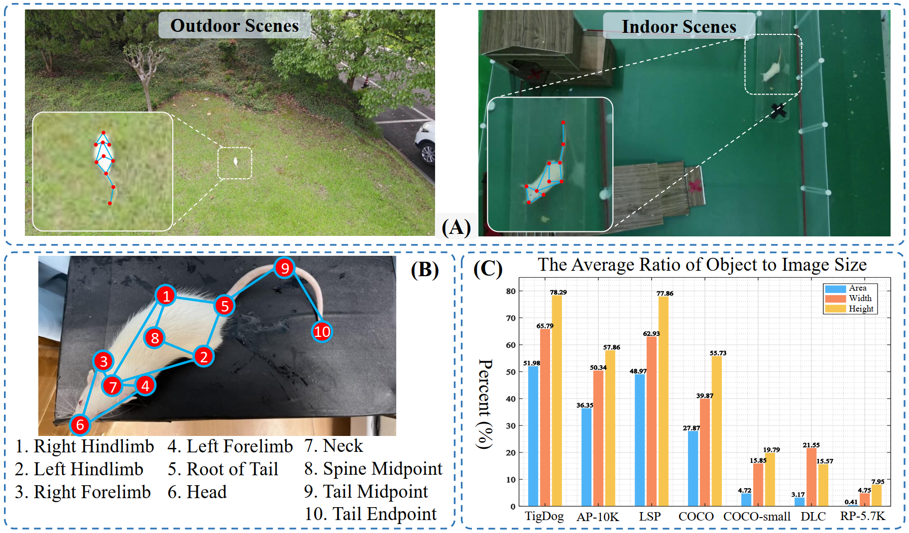

# RP-5.7K
Small-sized rat pose estimation dataset.

## Dataset Overview
### 1. Illustration of annotations
<p align="center">

</p>

## License
The dataset follows CC-BY-4.0 license.

If you are interested in our work, please cite the following:

```
@article{han2025small,
  title={Small Object Oriented Pose Estimation with Structural Similarity Constraint},
  author={Han, Le and Zhao, Lei and Zhang, Han and Song, Zhiying and Wang, Pengfei and Zheng, Nenggan},
  journal={IEEE Transactions on Instrumentation and Measurement},
  year={2025},
  publisher={IEEE}
}
```
